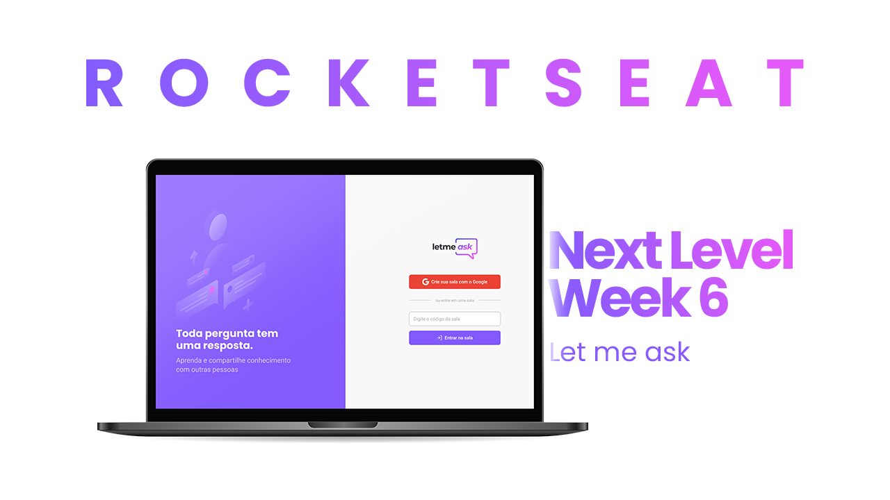

# Next level week 6 - Let me ask 🚀

## Tecnologias 💻

- React ⚛️
- Vite ⚡
- Firebase 🔥
- Typescript 💙

## Aula 1 - Configuração do projeto ⚙️

Configurações do React, Vite, Firebase, ESLint e Prettier.

## Autor

- [LinkedIn](https://linkedin.com/in/lima-eder)
- [GitHub](https://github.com/Nxrth-x)
- [Facebook](https://facebook.com/DCCLXXIX)

## Rocketseat 🚀

- [Next Level Week](https://nextlevelweek.com/)
- [Site](https://rocketseat.com.br/)
